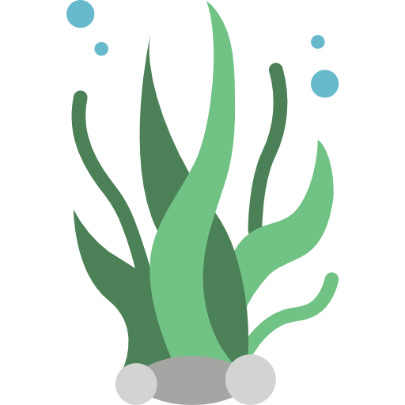
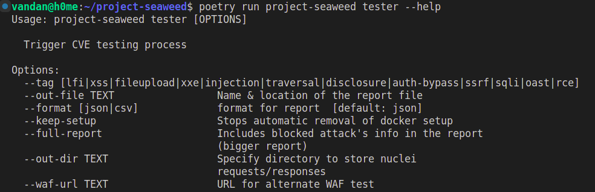

<h1 align="center">
Project Seaweed
<br>

</h1>

<sub><sup>image: Flaticon.com</sup></sub>

[](https://github.com/coreruleset/Project-Seaweed/actions?workflow=Tests)

Project Seaweed is a part of **Google Summer of Code 2022** under the OWASP Foundation Core Rule Set team. Under the guidance of [Felipe Zipitría](https://github.com/fzipi).

Seaweed is fully customizable CI/CD friendly tool created to automate the testing of web application firewalls against various CVE(s). 

It does so by utilising the PoCs provided by [nuclei-templates](https://github.com/projectdiscovery/nuclei-templates) from team [Project Discovery](https://github.com/projectdiscovery). Using these beautifully formatted yaml templates we can test firewalls as well as generate metadata for the firewall testing process. At the end of testing we receive a small summary notification in the form of a slack message.


## Features

1. **Parameters**

There are two ways to modify the tool behaviour. You can either use the CLI flags or specify environment variables.

**CLI:**



**Environment variables:**

Variable     | Default  | Description
---|---|---
WAF_IMAGE | owasp/modsecurity-crs:apache | Docker image to use for firewall setup
WEB_SERVER_IMAGE | httpd:latest| Docker image to use for web server setup
WAF_NAME |crs-waf| Docker container name for the firewall
WEB_SERVER_NAME |httpd-server| Docker container name for the web server
NETWORK_NAME | seaweed-network|Name of docker network
NUCLEI_THREADS | 10 |Speed of testing (higher threads lead to poor testing)
CVE_ID| None | CVE IDs to test
WAF_URL | None | Firewall URL if not setting up local docker
OUT_DIR | /tmp | Raw request / response output from nuclei
FULL_REPORT | False | Include blocked CVEs in the report
KEEP_SETUP | False | Keep the local docker setup (Usually for extracting audit logs from container)
OUT_FILE | report.json | name and path of the output report
TAG | None | Attack types to test (XSS, SQLi, RCE ...)
FORMAT | json | Report format
REPO_OWNER | None | Needed for working in a CI/CD environment

Commits:
- [f19772a72f35eda2728979d37361353729e2376c](https://github.com/coreruleset/project-seaweed/commit/f19772a72f35eda2728979d37361353729e2376c)
- [fd729f9838fd1d5590858c1bc04f4467e6869236](https://github.com/coreruleset/project-seaweed/commit/fd729f9838fd1d5590858c1bc04f4467e6869236)

2. **Docker Setup**

By default, a docker setup containing of Modsec-CRS reverse proxy container (Firewall) and an apache web server container is created and both the containers are attached to a network. This was done to have a local firewall setup. This has 2 advantages:

- Removes network latency and hence quicker testing
- Doesn't disturb the remote firewall

Ofcourse, this behaviour can be changed and you can specify a remote URL and avoid setting up the local docker setup.

This feature was achieved using docker-python SDK.

Commits:
- [f19772a72f35eda2728979d37361353729e2376c](https://github.com/coreruleset/project-seaweed/commit/f19772a72f35eda2728979d37361353729e2376c)
- [af5848e5dfa96f943e93a6812a070ae72357c7e5](https://github.com/coreruleset/project-seaweed/commit/af5848e5dfa96f943e93a6812a070ae72357c7e5)


3. **Report generation**

After Nuclei has finished launching the attacks on the firewall, we store the requests and responses that were made. You can specify a directory if you want to see this raw data, otherwise it is stored inside a temporary directory. 

We then use this data to figure out if the CVE is blocked or not. If the attack is multi-staged we calculate how much of the attack was blocked (blocked requests / total requests). Based on this a report is generated. 

You can specify the report format to be either `csv` or `json`.


Commits:
- [6162174081bb9fda1b8a5947ae33114e5f3c038a](https://github.com/coreruleset/project-seaweed/commit/6162174081bb9fda1b8a5947ae33114e5f3c038a)
- [400307edcad3505671ea7182249299aeb25a0a2c](https://github.com/coreruleset/project-seaweed/commit/400307edcad3505671ea7182249299aeb25a0a2c)
- [a45ec2cc116c6529e77046c0798dee82e05164f4](https://github.com/coreruleset/project-seaweed/commit/a45ec2cc116c6529e77046c0798dee82e05164f4)

4. **Testing analysis**

Throughout the whole process a `yaml` file is maintained which records various metrics and metadata such as blocked CVE(s), version of firewall used, environment variables etc. This file is then later used for comparing the results of two various scans.


Commits:
- [4695e817cc33ff67d3b746b236a838cb1e700088](https://github.com/coreruleset/project-seaweed/commit/4695e817cc33ff67d3b746b236a838cb1e700088)
- [9567995277f4c028059d40900eb0b0fd9fd2c6bb](https://github.com/coreruleset/project-seaweed/commit/9567995277f4c028059d40900eb0b0fd9fd2c6bb)


5. **Scan History**

If you're using the tool in a CI/CD environment like Github Actions, a repository named `seaweed-reports` is needed which records all the past scans and their respective artifacts. The github action tests various types of common web CVE(s) such as xss, rce, sqli etc. along with a full test of all the available CVE(s) in the nuclei templates. You can modify this behaviour according to the needs by changing the matrix of Github Action.

The directory structure looks like this:

```
Seaweed-Reports/
├── 2022
│   └── Aug
│       ├── 23
│       │   ├── rce-artifact
│       │   │   ├── rceAnalysis.yaml
│       │   │   └── rceReport.csv
│       │   ├── sqli-artifact
│       │   │   ├── sqliAnalysis.yaml
│       │   │   └── sqliReport.csv
│       └── 28
│           ├── rceArtifact
│           │   ├── rceAnalysis.yaml
│           │   └── rceReport.csv
│           ├── sqliArtifact
│           │   ├── sqliAnalysis.yaml
│           │   └── sqliReport.csv
└── latest.txt
```

Commits:
- [f2ffc7687c27b5eb21cfb557fb30890195293369](https://github.com/coreruleset/project-seaweed/commit/f2ffc7687c27b5eb21cfb557fb30890195293369)
- [3bcc3d13fb87dfeeacc5342caa04b3d5b94566da](https://github.com/coreruleset/project-seaweed/commit/3bcc3d13fb87dfeeacc5342caa04b3d5b94566da)

6. **Slack integration**

After the testing is finished, a message is sent to the defined channel on slack with a small summary.


Commits:
- [7fdfac397e9ba5e6925577264c5cffcc9106fc20](https://github.com/coreruleset/project-seaweed/commit/7fdfac397e9ba5e6925577264c5cffcc9106fc20)
- [973cf52b3830e6c85d2e46a884a34dac9c62350f](https://github.com/coreruleset/project-seaweed/commit/973cf52b3830e6c85d2e46a884a34dac9c62350f)

7. **Report comparison**

If running this tool in a local environment, you can use this feature to compare two different reports.


Commits:
- [4695e817cc33ff67d3b746b236a838cb1e700088](https://github.com/coreruleset/project-seaweed/commit/4695e817cc33ff67d3b746b236a838cb1e700088)
- [7fef82af890818a09239f02c910c42365761fa14](https://github.com/coreruleset/project-seaweed/commit/7fef82af890818a09239f02c910c42365761fa14)

8. **Fetching testing logs**

This project does not provide the functionality to automatically fetch the logs from CRS container. However, you can use the `--keep-setup` flag to prevent auto-removal of the docker setup (crs container, apache container and docker network). After that, you can fetch the audit logs using the following command.

`docker cp crs-waf:/root/audit.log <path to save log file>`

**Caveat**: If you specify `--keep-setup`, you are responsible for performing the cleanup activity. To do that, just enter the following commands.

`docker stop crs-waf`

`docker stop httpd-server`

`docker network rm seaweed-network`

Commits:
- [64a8aefae60232bc6843a52abfd261b1ab78a721](https://github.com/coreruleset/project-seaweed/commit/64a8aefae60232bc6843a52abfd261b1ab78a721)

## Post GSoC work

1. The slack integration present in the github action can be integrated with the report comparison feature. Report comparison only prints the output, so it should have the feature to push comparison output to a file or slack message.

2. More test coverage. Currently at 90%.

3. Improve documentation and fix code (bugs) as needed.

## Usage

**Installation**

1. **Clone the repository**

`git clone https://github.com/coreruleset/Project-Seaweed.git`

2. **Install poetry** 

Poetry is a tool for dependency management and packaging in Python. 

[https://python-poetry.org/docs/#installation](https://python-poetry.org/docs/#installation)

3. **Install docker**

This project needs docker to setup a local web server, web application firewall. If you're using a custom waf URL for testing, then docker is not needed. 

[https://docs.docker.com/engine/install/](https://docs.docker.com/engine/install/)

5. **Install Nuclei**

The program uses Nuclei to launch attacks. Make sure nuclei is in the path and nuclei templates are installed in the home directory and not a custom directory. Install from here: [https://nuclei.projectdiscovery.io/nuclei/get-started/#nuclei-installation](https://nuclei.projectdiscovery.io/nuclei/get-started/#nuclei-installation)


6. **Install the project**

`poetry install`

7. **Finally run the project**

`poetry run project-seaweed`

8. **Get help**

`poetry run project-seaweed --help`

For command specific help

`poetry run project-seaweed tester --help`
