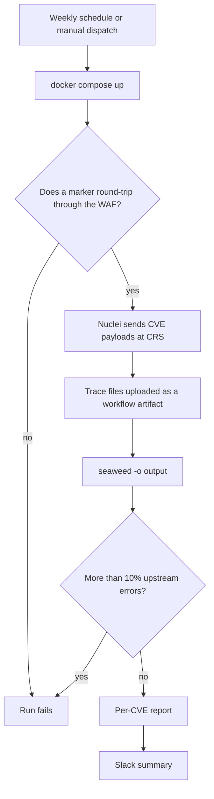

# Project Seaweed


image: Flaticon.com

[](https://github.com/coreruleset/project-seaweed/actions/workflows/scheduled_job.yaml)

Project Seaweed was originally a part of **Google Summer of Code 2022** under the OWASP Foundation Core Rule Set team.
Under the guidance of [Felipe Zipitría](https://github.com/fzipi).

Seaweed is a CI/CD friendly tool created to automate the testing of web application firewalls against various CVE(s).

It does so by utilising the PoCs provided by [nuclei-templates](https://github.com/projectdiscovery/nuclei-templates)
from team [Project Discovery](https://github.com/projectdiscovery). Using these beautifully formatted yaml templates we
can test firewalls as well as generate metadata for the firewall testing process. At the end of testing we receive a
small summary notification in the form of a slack message.


```mermaid
flowchart TD
    A[Weekly schedule or manual dispatch] --> B[docker compose up]
    B --> C{Does a marker round-trip through the WAF?}
    C -->|no| X[Run fails]
    C -->|yes| D[Nuclei sends CVE payloads at CRS]
    D --> E[Trace files uploaded as a workflow artifact]
    E --> F[seaweed -o output]
    F --> G{More than 10% upstream errors?}
    G -->|yes| X
    G -->|no| H[Per-CVE report]
    H --> I[Slack summary]
```

## Features

1. **Parameters**

`seaweed` reads Nuclei's trace files and reports on them. It takes no configuration beyond its flags:

```
❯ ./project-seaweed --help
Parses Nuclei test files output

Usage:
  seaweed [flags]
  seaweed [command]

Available Commands:
  completion  Generate the autocompletion script for the specified shell
  gen-mock    Generate the mock backend page from Nuclei flow-gated templates
  help        Help about any command

Flags:
  -f, --format format   format to output the results; can be 'github' (default) or 'json' (default github)
  -h, --help            help for seaweed
  -o, --output string   path to find output trace files (default ".")
```

Which CVEs get tested is a property of the scan, not the reporter. Set `SEAWEED_TAGS` to override the Nuclei tags in
`docker-compose.yml`:

```
SEAWEED_TAGS=xss,sqli docker compose up
```

2. **Docker Setup**

`docker compose up` creates a ModSec-CRS reverse proxy container (the firewall) in front of a mock backend, on a shared
network. This was done to have a local firewall setup. This has 2 advantages:

- Removes network latency and hence quicker testing
- Doesn't disturb the remote firewall

Nuclei only starts once a request has been proven to round-trip through the WAF to the backend, so a broken environment
fails the run instead of reporting every payload as unblocked.

The mock backend answers every path with `mock/fingerprints.html`, a generated page carrying the strings that
flow-gated Nuclei templates look for before they send their payload. Regenerate it when the templates change:

```
git clone --depth 1 https://github.com/projectdiscovery/nuclei-templates.git
go run . gen-mock
```

See [docs/adr](docs/adr) for why.

3. **Report generation**

Nuclei writes one trace file per CVE into `output/`, holding every request it sent and every response it got.
`seaweed -o output` reads them.

Every CVE ends up in exactly one bucket: fully blocked, partially blocked when only some stages of a multi-stage attack
were stopped, not blocked, or errored.

Errored means the reverse proxy answered about itself — `408`, `500`, `502`, `503`, `504` — so the WAF never reached a
verdict on the payload. Those are counted separately rather than as "the WAF let it through", and seaweed exits
non-zero when more than 10% of a run errored, or when no trace files were found at all, because such a run does not
measure blocking.

The `github` format writes `key=value` pairs meant for `$GITHUB_OUTPUT`:

```
❯ ./project-seaweed -o output
total_requests=72
total_blocked=35
total_not_blocked=37
total_errored=0
cves_tested=42
cves_blocked=12
cves_partially_blocked=17
cves_not_blocked=13
cves_errored=0
```

The `json` format writes the same counters plus the CVE ids in each bucket:

```
❯ ./project-seaweed -o output -f json
```

4. **Scan History**

The recommended usage of this tool is in a CI/CD environment like GitHub Actions. The workflow runs weekly against the
tags listed in `docker-compose.yml` — xss, rce, sqli and the other common web CVE categories.

5. **Slack integration**

After the testing is finished, a message is sent to the defined channel on slack with a small summary: CVEs tested,
CVEs blocked, CVEs partially blocked, CVEs not blocked, requests sent, and upstream errors. A run that fails its error
gate sends nothing, rather than a summary of a scan that measured nothing.

6. **Report comparison**

TBD

## Usage

1. **Clone the repository**

`git clone https://github.com/coreruleset/project-seaweed.git`

2. **Install docker**

This project needs docker to set up the local web server and web application firewall.

[https://docs.docker.com/engine/install/](https://docs.docker.com/engine/install/)

3. **Build the project**

You need go installed on your system to build the project.

`go build`

4. **Run the scan**

```
docker compose up
```

This starts the containers and runs the tests. Trace files land in `output/`.

Now run the reporting tool:

`./project-seaweed -o output`

## Development

```
go test ./...        # unit tests
go run . gen-mock    # regenerate the mock backend page
```

Architecture decisions, and the measurements behind them, are recorded in [docs/adr](docs/adr).
