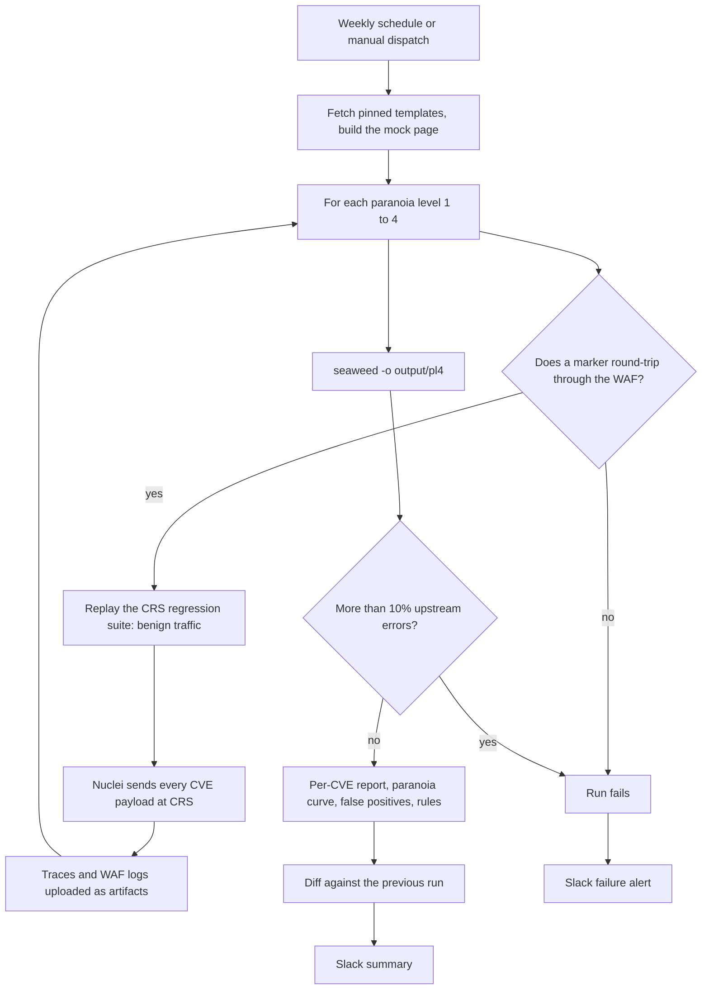

#  Project Seaweed

<sub>Seaweed icon by <a href="https://www.flaticon.com/">Flaticon</a>.</sub>

[](https://github.com/coreruleset/project-seaweed/actions/workflows/scheduled_job.yaml)

Project Seaweed was originally a part of **Google Summer of Code 2022** under the OWASP Foundation Core Rule Set team.
Under the guidance of [Felipe Zipitría](https://github.com/fzipi).

Seaweed is a CI/CD friendly tool created to automate the testing of web application firewalls against various CVE(s).

It does so by utilising the PoCs provided by [nuclei-templates](https://github.com/projectdiscovery/nuclei-templates)
from team [Project Discovery](https://github.com/projectdiscovery). Using these beautifully formatted yaml templates we
can test firewalls as well as generate metadata for the firewall testing process. At the end of testing we receive a
small summary notification in the form of a slack message.


```mermaid
flowchart TD
    A[Weekly schedule or manual dispatch] --> B[Fetch pinned templates, build the mock page]
    B --> C[For each paranoia level 1 to 4]
    C --> D{Does a marker round-trip through the WAF?}
    D -->|no| X[Run fails]
    D -->|yes| E[Replay the CRS regression suite: benign traffic]
    E --> F[Nuclei sends every CVE payload at CRS]
    F --> G[Traces and WAF logs uploaded as artifacts]
    G --> C
    C --> H[seaweed -o output/pl4]
    H --> I{More than 10% upstream errors?}
    I -->|yes| X
    I -->|no| J[Per-CVE report, paranoia curve, false positives, rules]
    J --> K[Diff against the previous run]
    K --> L[Slack summary]
    X --> M[Slack failure alert]
```

## Features

1. **Parameters**

`seaweed` reads Nuclei's trace files and reports on them. It takes no configuration beyond its flags:

```
❯ ./project-seaweed --help
Parses Nuclei test files output

Usage:
  seaweed [flags]
  seaweed [command]

Available Commands:
  completion      Generate the autocompletion script for the specified shell
  diff            Compare two JSON reports and show what moved
  false-positives Replay the CRS regression suite and count the rules that fire when they should not
  gen-mock        Generate the mock backend page from Nuclei flow-gated templates
  help            Help about any command
  rules           Report which CRS rules did the blocking, and which fired without managing it
  sweep           Report every paranoia level under a directory

Flags:
  -f, --format format      format to output the results; can be 'github' (default), 'json' or 'slack' (default github)
  -h, --help               help for seaweed
  -o, --output string      path to one run's output trace files; several runs under one path get merged together (default ".")
      --run-url string     link to include in the slack message, usually the CI run
      --templates string   path to the Nuclei templates, used to tell a gated template from one that simply finished (default "nuclei-templates/http/cves")

Use "seaweed [command] --help" for more information about a command.
```

Which CVEs get tested is a property of the scan, not the reporter. The scan runs every CVE template under
`http/cves` — 4149 of them. Set `SEAWEED_TAGS` to narrow that while iterating, which is much faster:

```
SEAWEED_TAGS=xss,sqli docker compose up
```

2. **Docker Setup**

`docker compose up` creates a ModSec-CRS reverse proxy container (the firewall) in front of a mock backend, on a shared
network. This was done to have a local firewall setup. This has 2 advantages:

- Removes network latency and hence quicker testing
- Doesn't disturb the remote firewall

Nuclei only starts once a request has been proven to round-trip through the WAF to the backend, so a broken environment
fails the run instead of reporting every payload as unblocked.

The mock backend answers every path with `mock/fingerprints.html`, a generated page carrying the strings that
flow-gated Nuclei templates look for before they send their payload — both the `words` of their matchers and the
literals inside `contains(body, ...)` style `dsl` gates, which want the same thing written differently. It is not
committed — build it from the pinned templates before bringing the environment up, which is what the scan itself does:

```
./scripts/fetch-templates.sh
go run . gen-mock
```

The pinned version lives in `scripts/fetch-templates.sh`. Pinning it is what makes one week's numbers comparable to
the next. Generating the page from that same pin, on every run, is what keeps the scan and the fingerprints in step.
If you forget, the mock never reports healthy and nothing else starts.

See [docs/adr](docs/adr) for why.

3. **Report generation**

Nuclei writes one trace file per CVE into `output/`, holding every request it sent and every response it got.
`seaweed -o output` reads them.

`-o` wants **one run's** output directory. It walks the tree and merges files by CVE, which is right for one run across
several targets or protocols, and wrong across runs: pointing it at a parent holding several scans blends them into a
number that describes no configuration at all. The paranoia sweep keeps each level in `output/pl1` … `output/pl4` for
this reason.

Every CVE ends up in exactly one bucket:

| bucket | meaning |
| --- | --- |
| blocked | every payload the template sent was refused |
| partially blocked | a payload reached the backend while another was refused |
| not blocked | the payload reached the backend |
| not exercised | the template never sent an attack, so the WAF was never asked |
| no verdict | none of its requests reached the backend or got an answer from it |

"Blocked" is deliberately wider than "every request came back 403". A template that reads a
plugin's version before attacking, or that checks afterwards for the file its blocked upload
would have written, gets a `200` for a request that carried no attack — 413 CVEs in one run
were filed as *partially* blocked on the strength of exactly that. What counts is whether
anything the template actually threw got through
([ADR 19](docs/adr/0019-every-payload-blocked-is-a-block.md)).

Three cases are held back from that reading, because for them a plain request can be the whole
attack: a class like missing authorization or information exposure, a WAF that refused only the
template's own login step, and any path carrying a traversal sequence, an encoded character or
a system filename.

Only three of those describe the WAF. A request can also be:

- **errored** — `408`, `500`, `502`, `503`, `504`: the reverse proxy answering about itself. Seaweed exits non-zero
  when more than 10% of a run errored, or when no trace files were found, because such a run does not measure blocking.
- **rejected** — the server in front of the backend refused the request before the payload landed: a malformed
  request, or an encoded slash, which Apache rejects during URI translation before ModSecurity's phase 2 blocking rule
  can act.

This is decided by reading the response body, not the status code. The mock serves `seaweed-mock-ok` in every response
it produces, so its presence proves the request reached the application. An application's own `404` and Apache
refusing an encoded slash are the same status code and opposite meanings; only the body separates them. A success or a
redirect always counts as delivered, marker or not.

Neither is a verdict, so neither counts for or against the WAF, and neither is in the block rate.

"Not exercised" covers two shapes. A **flow-gated** template can stop at its detection step; one without a gate sends
everything it has, so a trace holding only a bare `GET /` means that was the whole attack, and `seaweed` reads
`nuclei-templates/` to tell the two apart. The second shape is a template whose whole trace is a fetch of a file
describing the application — `GET /wp-content/plugins/<slug>/readme.txt` is the single most common request in a run,
and 58 of the 60 templates that stop there read a version and run it through `compare_versions`. Nothing malicious is
sent, so there is nothing for a WAF to have missed ([ADR 9](docs/adr/0009-only-gated-templates-can-be-unexercised.md)).

Point `--templates` elsewhere, or run without them, and every unsent CVE keeps the pessimistic reading.

The `github` format writes `key=value` pairs meant for `$GITHUB_OUTPUT`:

```
❯ ./project-seaweed -o output/pl4
total_requests=6457
total_blocked=3897
total_not_blocked=2467
total_errored=3
total_rejected=90
cves_tested=4122
cves_blocked=2772
cves_partially_blocked=225
cves_not_blocked=952
cves_no_verdict=64
cves_not_exercised=109
cves_access_control=390
block_rate_addressable=74.5
```

The last two are a second view of the same CVEs rather than a sixth bucket. `CWE-862` and its
neighbours — missing authorization, missing authentication, improper access control — describe
attacks where the malicious request is, byte for byte, one a legitimate user could send. Whether
it is an attack depends on who sent it, which the application knows and a WAF does not. They stay
in the counts, and `block_rate_addressable` is the rate with them removed from both halves of the
fraction, so the headline does not carry a question no ruleset can answer. CRS blocks 121 of the
390 anyway, which is why they are not simply dropped
([ADR 18](docs/adr/0018-count-access-control-cves-separately.md)).

The `json` format writes the same counters plus the CVE ids in each bucket:

```
❯ ./project-seaweed -o output -f json
```

The `slack` format writes a Block Kit message on a single line, which the workflow carries in a job output:

```
❯ ./project-seaweed -o output -f slack --run-url "$RUN_URL"
```

4. **Scan History**

The recommended usage of this tool is in a CI/CD environment like GitHub Actions. The workflow runs weekly against
every CVE template in the pinned Nuclei corpus.

It scans at every paranoia level, because one level is one point on a curve and PL1 is what most CRS installs actually
run. `seaweed sweep output` reads each level's directory and reports them together:

```
❯ ./project-seaweed sweep output
PL1   50%  ██████████░░░░░░░░░░   1966 blocked   1622 not blocked
PL2   57%  ███████████░░░░░░░░░   2265 blocked   1317 not blocked
PL3   65%  █████████████░░░░░░░   2565 blocked   1146 not blocked
PL4   70%  ██████████████░░░░░░   2772 blocked    952 not blocked
```

That table goes to both the job summary and the Slack message. Paranoia 4 stays the headline number and drives the
run-to-run diff, for continuity. Set `SEAWEED_PARANOIA` to scan a single level locally, and `SEAWEED_OUTPUT` to send
its traces somewhere of their own.

Templates attacking an authenticated endpoint interpolate `{{username}}` and friends. `docker-compose.yml` supplies
them with `-var`; without them nuclei refuses to send the request and the CVE is reported as never exercised. The
values are irrelevant — the mock accepts anything, and what is measured is whether the WAF stops the payload.

The same file pins the User-Agent with `-H`. Left alone nuclei rotates one per request — 902 distinct values in a
single run — and CRS answers some of them differently: rule 932237 scores 5 on its own, the threshold, for a browser
string containing `ss` or a Spanish or Dutch locale tag. That invented blocks the ruleset never earned and made two
identical runs disagree on 48 CVEs. Pinned, they disagree on 2
([ADR 20](docs/adr/0020-pin-the-user-agent.md)).

**The curve only shows one side.** More blocking at a higher paranoia level costs false positives. `seaweed
false-positives` measures those against CRS's own regression suite:

```
./scripts/fetch-crs-tests.sh
./project-seaweed false-positives 127.0.0.1:8080 --audit-log logs/pl4/modsec_audit.json
```

The weekly run does this at every paranoia level and puts the result in the job summary. It sends the benign traffic
while only the WAF is up, then reads the audit log after copying it out of the container — `--no-send` is the second
half of that split.

It replays every stage of the suite that asserts a rule must *not* fire, then checks the audit log for whether one did.

The benign replay marks each request with an `X-Seaweed-Case` header, so joining a stage to its audit entry is exact.
It also fills in a `Host` and an `Accept` header when a stage carries none: a numeric `Host` trips 920350 and a missing
`Accept` trips 920300, and either is enough to carry a request the suite calls benign over the blocking threshold.

`seaweed rules logs/pl4/modsec_audit.json` reads the same log from the other direction: which rules contributed to
blocks, and which attack rules fired without managing one. A transaction is blocked when 949110 fired, so this needs no
join with the trace files. Contribution rather than cause, because CRS blocks on an accumulated score.

Blocking is reported separately and is deliberately **not** the measurement: many of those stages carry real attack
payloads and assert only that a neighbouring rule stays quiet, so CRS is right to block them.

It is calibrated: run against CRS's own reference stack, go-ftw reports 0 failures, and against ours it reports 100 —
of which this tool finds 97, a strict subset. Matching the ruleset to the corpus takes both to **0**. See
[ADR 13](docs/adr/0013-measure-false-positives-against-the-crs-suite.md) and
[ADR 14](docs/adr/0014-run-a-current-crs.md).

Keep the WAF and the corpus on the same CRS release. Measuring a v4.28.0 corpus against a 4.1.0 ruleset produced 97
false positives that were entirely an artefact of the mismatch.

5. **Slack integration**

After the testing is finished, a message is sent to the defined channel on slack. It leads with the block rate at the
highest paranoia level — the share of CVEs the WAF blocked outright, out of those it reached any verdict on — and then
the whole curve:

```
🛡 70% of CVEs blocked at PL4

PL1  🟩🟩🟩🟩🟩🟩🟩⬜⬜⬜⬜⬜⬜⬜⬜  50%
PL2  🟩🟩🟩🟩🟩🟩🟩🟩🟩⬜⬜⬜⬜⬜⬜  57%
PL3  🟩🟩🟩🟩🟩🟩🟩🟩🟩🟩⬜⬜⬜⬜⬜  65%
PL4  🟩🟩🟩🟩🟩🟩🟩🟩🟩🟩🟩⬜⬜⬜⬜  70%

2772 blocked · 952 not blocked
225 partially blocked · 109 not exercised
390 access-control · 74% blocked excluding them

4122 CVEs · 6457 requests · 90 rejected · 3 upstream errors · view the run
```

Colour rather than a code block because Slack renders emoji as emoji inside one too, which
destroys the alignment a code block is for. Fifteen cells rather than ten: a real curve gains
about six points a level, so ten rounds neighbouring levels onto the same bar
([ADR 12](docs/adr/0012-put-the-paranoia-curve-in-the-notification.md)).

The layout is built by `seaweed -f slack`, so it is covered by tests rather than assembled from workflow expressions.

A run that fails — because the environment never came up, because the scan produced nothing, or because too much of it
errored — sends a red alert linking to the logs instead of a summary of a scan that measured nothing. A cancelled run
stays silent.

6. **Report comparison**

`seaweed diff previous.json current.json` compares two JSON reports and leads with the CVEs the WAF used to block and
no longer does. The scheduled run does this automatically against the previous successful run and writes the result to
the job summary.

Read the totals before the names. Some templates randomise their own payload, so a couple of CVEs change bucket
between two identical runs — 2 in the last measurement. It used to be about 48, almost all of it nuclei rotating the
User-Agent until that was pinned; CRS answers some browser strings differently from others. A handful of individual
CVEs moving is noise; a bucket total moving is not.

## Usage

1. **Clone the repository**

`git clone https://github.com/coreruleset/project-seaweed.git`

2. **Install docker**

This project needs docker to set up the local web server and web application firewall.

[https://docs.docker.com/engine/install/](https://docs.docker.com/engine/install/)

3. **Build the project**

You need go installed on your system to build the project.

`go build`

4. **Fetch the pinned templates and build the mock backend page**

```
./scripts/fetch-templates.sh
go run . gen-mock
```

The first downloads the pinned version into `nuclei-templates/`, which both the scan and `gen-mock` read; the directory
is managed by the script and replaced wholesale. The second writes `mock/fingerprints.html` from those templates. That
page is generated rather than committed, so it cannot go stale — and if you skip this step the mock never reports
healthy and nothing else starts.

5. **Run the scan**

```
docker compose up
```

This starts the containers and runs the tests. Trace files land in `output/`. `SEAWEED_PARANOIA` picks a single level,
`SEAWEED_OUTPUT` sends the traces somewhere of their own, and `SEAWEED_TAGS` narrows the corpus — worth all three while
iterating, since the full run is 4149 templates at four levels:

```
SEAWEED_PARANOIA=1 SEAWEED_OUTPUT=./scratch SEAWEED_TAGS=xss docker compose up
```

Never point a run at `./output` if it holds traces you want: filenames collide across runs and the second one
overwrites the first. The WAF's own error and JSON audit logs
— the latter carrying the CRS rule ids behind each block — stay inside the container, because that directory has to be
writable by the user Apache runs as. Copy them out afterwards:

```
docker compose cp crs:/var/log/apache2/. logs/
```

Now run the reporting tool:

`./project-seaweed -o output`

On Linux, Nuclei writes `output/http` as root with mode 0700, so your user cannot read it and the report comes back
empty. Fix the permissions once after each scan:

```
sudo chmod -R a+rX output
```

## Development

```
go test -race ./...           # unit tests
golangci-lint run             # linters
./scripts/fetch-templates.sh  # download the pinned Nuclei templates
go run . gen-mock             # rebuild the mock backend page from them
./scripts/fetch-crs-tests.sh  # download the CRS regression suite, for the benign pass
```

Architecture decisions, and the measurements behind them, are recorded in [docs/adr](docs/adr).
