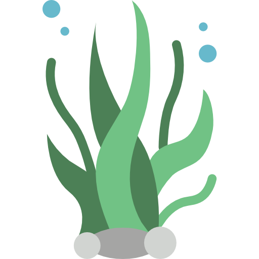
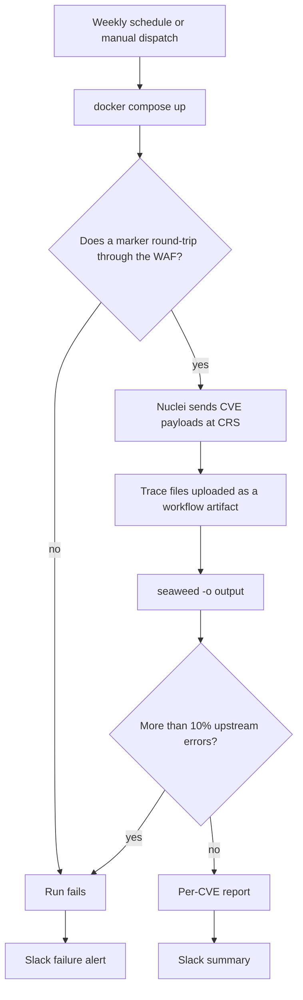

# Project Seaweed



image: Flaticon.com

[](https://github.com/coreruleset/project-seaweed/actions/workflows/scheduled_job.yaml)

Project Seaweed was originally a part of **Google Summer of Code 2022** under the OWASP Foundation Core Rule Set team.
Under the guidance of [Felipe Zipitría](https://github.com/fzipi).

Seaweed is a CI/CD friendly tool created to automate the testing of web application firewalls against various CVE(s).

It does so by utilising the PoCs provided by [nuclei-templates](https://github.com/projectdiscovery/nuclei-templates)
from team [Project Discovery](https://github.com/projectdiscovery). Using these beautifully formatted yaml templates we
can test firewalls as well as generate metadata for the firewall testing process. At the end of testing we receive a
small summary notification in the form of a slack message.


```mermaid
flowchart TD
    A[Weekly schedule or manual dispatch] --> B[docker compose up]
    B --> C{Does a marker round-trip through the WAF?}
    C -->|no| X[Run fails]
    C -->|yes| D[Nuclei sends CVE payloads at CRS]
    D --> E[Trace files uploaded as a workflow artifact]
    E --> F[seaweed -o output]
    F --> G{More than 10% upstream errors?}
    G -->|yes| X
    G -->|no| H[Per-CVE report]
    H --> I[Slack summary]
    X --> J[Slack failure alert]
```

## Features

1. **Parameters**

`seaweed` reads Nuclei's trace files and reports on them. It takes no configuration beyond its flags:

```
❯ ./project-seaweed --help
Parses Nuclei test files output

Usage:
  seaweed [flags]
  seaweed [command]

Available Commands:
  completion      Generate the autocompletion script for the specified shell
  diff            Compare two JSON reports and show what moved
  false-positives Replay the CRS regression suite and count the rules that fire when they should not
  gen-mock        Generate the mock backend page from Nuclei flow-gated templates
  help            Help about any command
  sweep           Report every paranoia level under a directory

Flags:
  -f, --format format      format to output the results; can be 'github' (default), 'json' or 'slack' (default github)
  -h, --help               help for seaweed
  -o, --output string      path to one run's output trace files; several runs under one path get merged together (default ".")
      --run-url string     link to include in the slack message, usually the CI run
      --templates string   path to the Nuclei templates, used to tell a gated template from one that simply finished (default "nuclei-templates/http/cves")

Use "seaweed [command] --help" for more information about a command.
```

Which CVEs get tested is a property of the scan, not the reporter. Set `SEAWEED_TAGS` to override the Nuclei tags in
`docker-compose.yml`:

```
SEAWEED_TAGS=xss,sqli docker compose up
```

2. **Docker Setup**

`docker compose up` creates a ModSec-CRS reverse proxy container (the firewall) in front of a mock backend, on a shared
network. This was done to have a local firewall setup. This has 2 advantages:

- Removes network latency and hence quicker testing
- Doesn't disturb the remote firewall

Nuclei only starts once a request has been proven to round-trip through the WAF to the backend, so a broken environment
fails the run instead of reporting every payload as unblocked.

The mock backend answers every path with `mock/fingerprints.html`, a generated page carrying the strings that
flow-gated Nuclei templates look for before they send their payload — both the `words` of their matchers and the
literals inside `contains(body, ...)` style `dsl` gates, which want the same thing written differently. It is generated from the pinned templates, and CI
fails if it drifts from them:

```
./scripts/fetch-templates.sh
go run . gen-mock
```

The pinned version lives in `scripts/fetch-templates.sh`. Pinning it is what makes one week's numbers comparable to
the next, and what keeps the scan and the fingerprint page in step.

See [docs/adr](docs/adr) for why.

3. **Report generation**

Nuclei writes one trace file per CVE into `output/`, holding every request it sent and every response it got.
`seaweed -o output` reads them.

`-o` wants **one run's** output directory. It walks the tree and merges files by CVE, which is right for one run across
several targets or protocols, and wrong across runs: pointing it at a parent holding several scans blends them into a
number that describes no configuration at all. The paranoia sweep keeps each level in `output/pl1` … `output/pl4` for
this reason.

Every CVE ends up in exactly one bucket:

| bucket | meaning |
| --- | --- |
| blocked | every request the WAF judged, it blocked |
| partially blocked | only some stages of a multi-stage attack were stopped |
| not blocked | the payload reached the backend |
| not exercised | a flow-gated template never sent anything but a bare `GET /`, so its payload step never ran and the WAF was never asked |
| no verdict | none of its requests reached the backend or got an answer from it |

Only three of those describe the WAF. A request can also be:

- **errored** — `408`, `500`, `502`, `503`, `504`: the reverse proxy answering about itself. Seaweed exits non-zero
  when more than 10% of a run errored, or when no trace files were found, because such a run does not measure blocking.
- **rejected** — the server in front of the backend refused the request before the payload landed: a malformed
  request, or an encoded slash, which Apache rejects during URI translation before ModSecurity's phase 2 blocking rule
  can act.

This is decided by reading the response body, not the status code. The mock serves `seaweed-mock-ok` in every response
it produces, so its presence proves the request reached the application. An application's own `404` and Apache
refusing an encoded slash are the same status code and opposite meanings; only the body separates them. A success or a
redirect always counts as delivered, marker or not.

Neither is a verdict, so neither counts for or against the WAF, and neither is in the block rate.

Only a **flow-gated** template can be "not exercised". One without a gate sends everything it has, so a trace holding
only a bare `GET /` means that was the whole attack. `seaweed` reads `nuclei-templates/` to tell the two apart; point
`--templates` elsewhere, or run without them and every unsent CVE keeps the pessimistic reading.

The `github` format writes `key=value` pairs meant for `$GITHUB_OUTPUT`:

```
❯ ./project-seaweed -o output
total_requests=3775
total_blocked=2388
total_not_blocked=1249
total_errored=2
total_rejected=136
cves_tested=2710
cves_blocked=1588
cves_partially_blocked=295
cves_not_blocked=533
cves_no_verdict=100
cves_not_exercised=194
```

The `json` format writes the same counters plus the CVE ids in each bucket:

```
❯ ./project-seaweed -o output -f json
```

The `slack` format writes a Block Kit message on a single line, which the workflow carries in a job output:

```
❯ ./project-seaweed -o output -f slack --run-url "$RUN_URL"
```

4. **Scan History**

The recommended usage of this tool is in a CI/CD environment like GitHub Actions. The workflow runs weekly against the
tags listed in `docker-compose.yml` — xss, rce, sqli and the other common web CVE categories.

It scans at every paranoia level, because one level is one point on a curve and PL1 is what most CRS installs actually
run. `seaweed sweep output` reads each level's directory and reports them together:

```
❯ ./project-seaweed sweep output
PL1   54%  ███████████░░░░░░░░░   1375 blocked    807 not blocked
PL2   58%  ████████████░░░░░░░░   1467 blocked    713 not blocked
PL3   60%  ████████████░░░░░░░░   1506 blocked    664 not blocked
PL4   64%  █████████████░░░░░░░   1622 blocked    550 not blocked
```

That table goes to both the job summary and the Slack message. Paranoia 4 stays the headline number and drives the
run-to-run diff, for continuity. Set `SEAWEED_PARANOIA` to scan a single level locally, and `SEAWEED_OUTPUT` to send
its traces somewhere of their own.

**The curve only shows one side.** More blocking at a higher paranoia level costs false positives. `seaweed
false-positives` measures those against CRS's own regression suite:

```
./scripts/fetch-crs-tests.sh
./project-seaweed false-positives 127.0.0.1:8080 --audit-log logs/pl4/modsec_audit.json
```

It replays every stage of the suite that asserts a rule must *not* fire, then checks the audit log for whether one did.
Each request carries an `X-Seaweed-Case` header so the join to the log is exact.

Blocking is reported separately and is deliberately **not** the measurement: many of those stages carry real attack
payloads and assert only that a neighbouring rule stays quiet, so CRS is right to block them.

It is calibrated: run against CRS's own reference stack, go-ftw reports 0 failures, and against ours it reports 100 —
of which this tool finds 97, a strict subset. Matching the ruleset to the corpus takes both to **0**. See
[ADR 13](docs/adr/0013-measure-false-positives-against-the-crs-suite.md) and
[ADR 14](docs/adr/0014-run-a-current-crs.md).

Keep the WAF and the corpus on the same CRS release. Measuring a v4.28.0 corpus against a 4.1.0 ruleset produced 97
false positives that were entirely an artefact of the mismatch.

5. **Slack integration**

After the testing is finished, a message is sent to the defined channel on slack. It leads with the block rate at the
highest paranoia level — the share of CVEs the WAF blocked outright, out of those it reached any verdict on — and then
the whole curve:

```
WAF test: 64% of CVEs blocked at PL4

PL1   52%  ██████████░░░░░░░░░░   1319 blocked    851 not blocked
PL2   58%  ████████████░░░░░░░░   1460 blocked    707 not blocked
PL3   59%  ████████████░░░░░░░░   1500 blocked    661 not blocked
PL4   64%  █████████████░░░░░░░   1614 blocked    555 not blocked

Partially blocked  360      Not exercised  80

2710 CVEs seen · 3863 requests at PL4 · 135 rejected by the server · 2 upstream errors · view the run
```

The layout is built by `seaweed -f slack`, so it is covered by tests rather than assembled from workflow expressions.

A run that fails — because the environment never came up, because the scan produced nothing, or because too much of it
errored — sends a red alert linking to the logs instead of a summary of a scan that measured nothing. A cancelled run
stays silent.

6. **Report comparison**

`seaweed diff previous.json current.json` compares two JSON reports and leads with the CVEs the WAF used to block and
no longer does. The scheduled run does this automatically against the previous successful run and writes the result to
the job summary.

Read the totals before the names. Nuclei randomises the User-Agent per request and some templates randomise their
payload, and neither can be turned off, so **about 48 CVEs change bucket between two identical runs**. A handful of
individual CVEs moving is noise; a bucket total moving is not.

## Usage

1. **Clone the repository**

`git clone https://github.com/coreruleset/project-seaweed.git`

2. **Install docker**

This project needs docker to set up the local web server and web application firewall.

[https://docs.docker.com/engine/install/](https://docs.docker.com/engine/install/)

3. **Build the project**

You need go installed on your system to build the project.

`go build`

4. **Fetch the pinned templates**

```
./scripts/fetch-templates.sh
```

This downloads the pinned version into `nuclei-templates/`, which both the scan and `gen-mock` read. The
directory is managed by the script and replaced wholesale.

5. **Run the scan**

```
docker compose up
```

This starts the containers and runs the tests. Trace files land in `output/`. The WAF's own error and JSON audit logs
— the latter carrying the CRS rule ids behind each block — stay inside the container, because that directory has to be
writable by the user Apache runs as. Copy them out afterwards:

```
docker compose cp crs:/var/log/apache2/. logs/
```

Now run the reporting tool:

`./project-seaweed -o output`

On Linux, Nuclei writes `output/http` as root with mode 0700, so your user cannot read it and the report comes back
empty. Fix the permissions once after each scan:

```
sudo chmod -R a+rX output
```

## Development

```
go test ./...                 # unit tests
./scripts/fetch-templates.sh  # download the pinned Nuclei templates
go run . gen-mock             # regenerate the mock backend page
```

Architecture decisions, and the measurements behind them, are recorded in [docs/adr](docs/adr).
